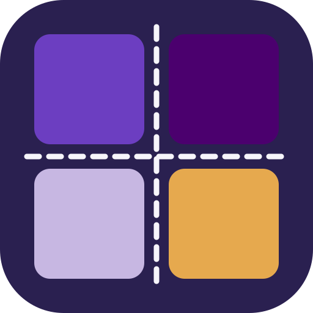

<p align="center">
  
</p>

<h1 align="center">Weave</h1>

<p align="center">
  The central identity provider for <a href="https://patchworklabs.org">Patchwork Labs</a>.<br />
  An OAuth 2.0 authorization server, member directory, and onboarding hub — stitched together.
</p>

---

Weave is the single front door to the Patchwork Labs ecosystem. It authenticates community
members, issues OAuth tokens to downstream apps, invites people into Slack and walks them
through a code-of-conduct onboarding flow, and (soon) provisions local Active Directory
accounts for resource access.

## What it does

- **OAuth 2.0 / OIDC provider** — a full authorization server built on [Doorkeeper](https://github.com/doorkeeper-gem/doorkeeper): Authorization Code (with PKCE), Client Credentials, and Refresh Token grants, plus UserInfo, Introspection, Revocation, and RFC 8414 discovery.
- **Passwordless auth** — magic-link sign-in by default, with password login available for staff accounts.
- **Slack onboarding** — invites new members as single-channel guests, DMs them a code of conduct via a Slackbot flow, and promotes them to full members once accepted. Profiles sync bidirectionally.
- **Member directory** — profiles, addresses, sessions, and a read-only account dashboard.
- **Directory provisioning** — local Active Directory account provisioning for managing access to internal resources *(in progress)*.

## Roles & access

Access is granted by three levels, in order:

| Access level | Can do |
| --- | --- |
| **admin** | Manage members and day-to-day operations |
| **superadmin** | Everything admin can, plus grant roles, impersonate, and other sensitive actions |
| **owner** | Full control |

`staff` and `board` are **attributes** layered on top — they configure things (e.g. how a member
appears, what they can see) but don't by themselves grant elevated access. Regular community
members have none of these.

## Tech stack

- **Ruby 4.0** · **Rails 8.1**
- **PostgreSQL 17** (pgvector) · **Redis 7**
- **Solid Queue / Cache / Cable** for jobs, caching, and websockets
- **Doorkeeper** (OAuth 2.0) · **Lockbox** (encryption) · **AASM** (state machines)
- **Propshaft** · **Tailwind CSS** · **Turbo** · **Stimulus** · **importmap**
- **Resend** for transactional email · **Flipper** feature flags · **Blazer** BI

## Quick start

Requires Ruby 4.0, PostgreSQL, Redis, and [Bun](https://bun.sh). See [SETUP.md](SETUP.md) for the full guide.

```bash
bundle install
bun install
bin/rails db:prepare
bin/dev            # web + CSS/JS watchers via Procfile.dev
```

Dev tooling (local): Flipper `/flipper`, Blazer `/blazer`, Mission Control `/admin/jobs`,
Letter Opener `/letter_opener`.

## OAuth endpoints

| Endpoint | Path |
| --- | --- |
| Authorization | `GET /oauth/authorize` |
| Token | `POST /oauth/token` |
| UserInfo | `GET /oauth/userinfo` |
| Introspection | `POST /oauth/introspect` |
| Revocation | `POST /oauth/revoke` |
| Discovery | `GET /oauth/.well-known/oauth-authorization-server` |

Supported grants: Authorization Code (PKCE), Client Credentials, Refresh Token. Integration
details in [docs/OAUTH.md](docs/OAUTH.md).

## Deployment

Production runs at **[weave.patchworklabs.org](https://weave.patchworklabs.org)** on the
`alastor` NixOS host — **not** Kamal.

1. Merging to `main` triggers a GitHub Actions build that publishes an `arm64` image to
   `ghcr.io/patchworklabsorg/weave`.
2. The host is provisioned via [deploy-rs](https://github.com/serokell/deploy-rs) from the
   infra repo's `weave` module: `weave-web` (Rails), `weave-worker` (Solid Queue), Postgres,
   and Redis as containers, fronted by Traefik with automatic TLS.

Health check: `GET /up`.

## Security

Passwords are BCrypt-hashed, sensitive fields are encrypted with Lockbox, requests are
throttled by Rack::Attack, OAuth redirect URIs are strictly validated, and console access is
audited via Console1984 / Audits1984. Continuous scanning runs Brakeman in CI.

## Brand

| | Hex | Use |
| --- | --- | --- |
| Ink | `#2a2050` | Text, grounding, the quilt binding |
| Grape | `#6c3ec1` | Primary accent |
| Deep Purple | `#4b006e` | Bold accents |
| Lavender | `#c7b7e2` | Soft highlights |
| Quilt | `#f7f5fb` | Backgrounds, stitching |

## License

Copyright © 2026 Patchwork Labs. See [LICENSE.md](LICENSE.md).
