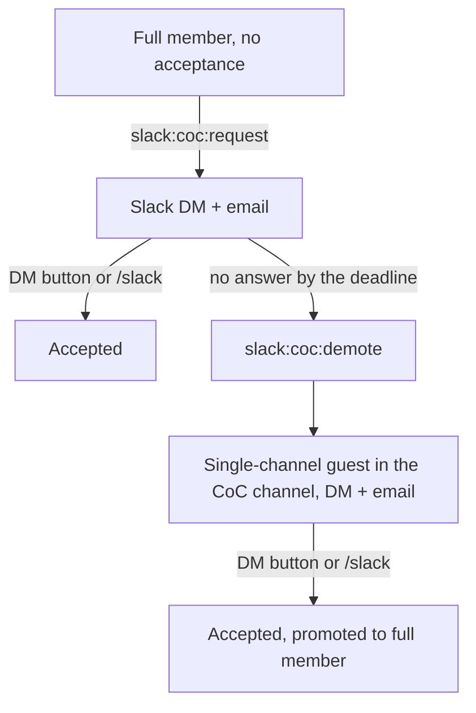

# Code of Conduct acceptance

Every Slack member accepts the Patchwork Labs Code of Conduct. New members accept it when they join (see `User#slack_onboarding_step`). This page is about members who joined before that step existed.

## The flow

- The DM button accepts at once. When the Slack import saved a placeholder name (`NOTSET`, `Unknown`, `User`), the button opens a Slack form instead. The form has a required "I have read and accept" box, and name fields when the name is missing.
- The email links to sign-in. After sign-in, `/` sends the member to `/slack`, which shows the same accept step and name fields.
- The message text is in `config/locales/code_of_conduct_request.en.yml`.

## Runbook

Run these in the production container.

1. Count the members: `bin/rails slack:coc:status`.
2. Preview the message: `bin/rails slack:coc:request DEADLINE=2026-11-01`.
3. Send it: `bin/rails slack:coc:request SEND=1 DEADLINE=2026-11-01`.
4. Optional: send a reminder: `bin/rails slack:coc:request SEND=1 REMIND=1 DEADLINE=2026-11-01`.
5. After the deadline, preview the demotions: `bin/rails slack:coc:demote ASKED_BEFORE=2026-10-15`.
6. Demote: `bin/rails slack:coc:demote CONFIRM=1 ASKED_BEFORE=2026-10-15`. Slack admins and owners cannot be demoted. They get a DM whose button opens the form with the box to check, and an email.

## App access

Every OAuth app requires the code of conduct (see `AppAccess`). A user who has not accepted cannot use the app. The authorize endpoint sends them to `/slack` to accept and then back to the app. Their existing tokens stop working until they accept.

A superadmin can opt out:

- one app, on the app's admin page (`oauth_applications.requires_code_of_conduct`), or
- one user, on the user's admin page (`users.code_of_conduct_exempt`). Exempt users are also not asked to accept and not demoted.

The access policy of the app still applies in both cases.
