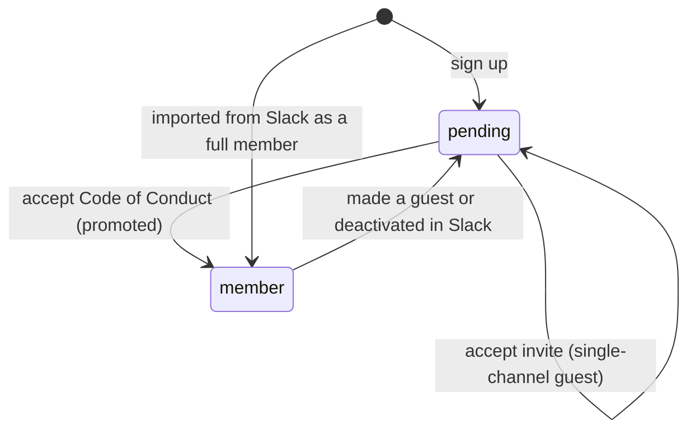
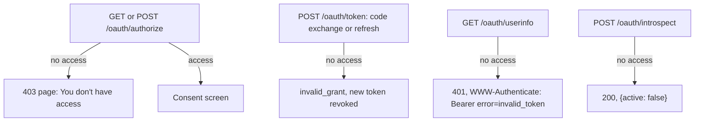
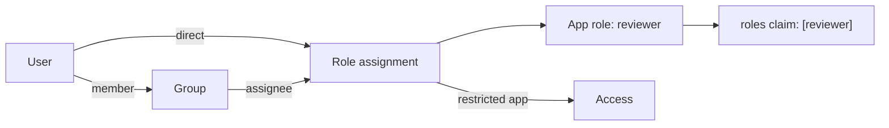

# OAuth 2.0 Provider Documentation

This Identity Provider (IDP) application uses [Doorkeeper](https://github.com/doorkeeper-gem/doorkeeper) to provide OAuth 2.0 authorization server functionality.

## Features

- **OAuth 2.0 Compliance**: Full RFC 6749 compliant authorization server
- **Multiple Grant Types**: Support for Authorization Code, Client Credentials, and Refresh Token flows
- **Scope-based Access Control**: Fine-grained permissions with scopes (profile, email, admin)
- **Token Management**: Access token generation, refresh, and revocation
- **Discovery Endpoints**: Standard OAuth 2.0 and OpenID Connect discovery support
- **PKCE Support**: Enhanced security for public clients

## OAuth 2.0 Endpoints

### Discovery Endpoints

- **OAuth 2.0 Server Metadata**: `GET /.well-known/oauth-authorization-server`
  - RFC 8414 compliant discovery endpoint
  - Returns server capabilities and endpoint URLs

- **OpenID Connect Discovery**: `GET /.well-known/openid-configuration`
  - OpenID Connect discovery endpoint
  - Returns OIDC-specific metadata

### Authorization Endpoints

- **Authorization Endpoint**: `GET /oauth/authorize`
  - Used to obtain authorization from the resource owner
  - Supports authorization code and implicit grant types

- **Token Endpoint**: `POST /oauth/token`
  - Used to exchange authorization codes for access tokens
  - Used to refresh access tokens
  - Used for client credentials grant

### Token Management

- **Revocation Endpoint**: `POST /oauth/revoke`
  - Revoke access or refresh tokens

- **Introspection Endpoint**: `POST /oauth/introspect`
  - Inspect token metadata and validity

- **Token Info**: `GET /oauth/token/info`
  - Get information about the current access token

### Resource Endpoints

- **UserInfo Endpoint**: `GET /oauth/userinfo`
  - Returns user information based on the access token
  - Respects granted scopes

## Supported Grant Types

1. **Authorization Code Grant** (Recommended for web applications)
   - Most secure OAuth 2.0 flow
   - Supports PKCE for additional security

2. **Client Credentials Grant** (For service-to-service communication)
   - Machine-to-machine authentication
   - No user interaction required

3. **Refresh Token Grant**
   - Obtain new access tokens without user interaction
   - Enabled by default

## Scopes

The OAuth provider supports the following scopes:

- `profile` (default): Access to basic profile information (name, username)
- `email`: Access to email address and verification status
- `admin`: Administrative privileges (restricted)
- `slack`: Patchwork Labs Slack membership (`slack_member`, `slack_id`)
- `groups`: the user's groups that are linked to this app (`groups`)
- `roles`: the user's roles in this app (`roles`)

The `profile` scope also includes `pronouns`, a non-standard claim (a free-text
string such as `they/them`). It is in the ID token and the userinfo response.
It is omitted when the user has not set pronouns.

### Slack membership claims

Signing up for Weave does not make someone a full member of the Patchwork Labs
Slack. New users join Slack as single-channel guests and become full members
only after they accept the Code of Conduct. Request the `slack` scope to tell
the two apart:

| Claim | Type | Meaning |
|-------|------|---------|
| `slack_member` | boolean | `true` when the user is a regular (non-guest) member of the Slack workspace. |
| `slack_id` | string | The user's Slack user ID. Omitted until they join Slack. Guests have one too, so check `slack_member` before you invite it to a channel. |

Users with `slack_member: false` can still sign in. Each client decides what to
allow them to do. Send them to `https://slack.patchworklabs.org` to finish
joining.



## Using the OAuth Provider

### 1. Register an OAuth Application

Administrators can register OAuth applications through the admin interface:

1. Navigate to `/admin/oauth_applications`
2. Click "New OAuth Application"
3. Fill in the application details:
   - **Name**: Application name
   - **Redirect URI**: Callback URL(s) for your application
   - **Scopes**: Requested scopes (space-separated)
   - **Confidential**: Whether the client can keep secrets secure

### 2. Authorization Code Flow Example

```
# Step 1: Redirect user to authorization endpoint
GET /oauth/authorize?
  client_id=YOUR_CLIENT_ID&
  redirect_uri=YOUR_REDIRECT_URI&
  response_type=code&
  scope=profile+email&
  state=RANDOM_STATE

# Step 2: User authorizes the application

# Step 3: Exchange authorization code for access token
POST /oauth/token
  grant_type=authorization_code&
  code=AUTHORIZATION_CODE&
  redirect_uri=YOUR_REDIRECT_URI&
  client_id=YOUR_CLIENT_ID&
  client_secret=YOUR_CLIENT_SECRET

# Response
{
  "access_token": "...",
  "token_type": "Bearer",
  "expires_in": 7200,
  "refresh_token": "...",
  "scope": "profile email"
}

# Step 4: Use access token to access resources
GET /oauth/userinfo
Authorization: Bearer ACCESS_TOKEN
```

### 3. Client Credentials Flow Example

```
POST /oauth/token
  grant_type=client_credentials&
  client_id=YOUR_CLIENT_ID&
  client_secret=YOUR_CLIENT_SECRET&
  scope=profile

# Response
{
  "access_token": "...",
  "token_type": "Bearer",
  "expires_in": 7200,
  "scope": "profile"
}
```

### 4. Using PKCE (Proof Key for Code Exchange)

For enhanced security, especially in public clients:

```
# Generate code verifier and challenge
code_verifier = BASE64URL(RANDOM(32))
code_challenge = BASE64URL(SHA256(code_verifier))

# Step 1: Authorization request with PKCE
GET /oauth/authorize?
  client_id=YOUR_CLIENT_ID&
  redirect_uri=YOUR_REDIRECT_URI&
  response_type=code&
  code_challenge=CODE_CHALLENGE&
  code_challenge_method=S256&
  scope=profile

# Step 2: Token request with code verifier
POST /oauth/token
  grant_type=authorization_code&
  code=AUTHORIZATION_CODE&
  redirect_uri=YOUR_REDIRECT_URI&
  client_id=YOUR_CLIENT_ID&
  code_verifier=CODE_VERIFIER
```

## Token Expiration

- **Access Tokens**: Expire after 2 hours
- **Refresh Tokens**: Can be used to obtain new access tokens without re-authorization

## Accounts that can no longer sign in

Locking, suspending or deactivating a user ends their access everywhere, not just in Weave:

- `/oauth/authorize` treats them as signed out, the same as every other Weave page. A browser session also has to be live (not signed out or expired) to count.
- All their access tokens (and with them, refresh tokens) and unredeemed authorization codes are revoked, for every client.
- As a backstop for changes that skip model callbacks, `/oauth/token` refuses to issue tokens for them (`invalid_grant`) and `/oauth/userinfo` answers `401` with `WWW-Authenticate: Bearer error="invalid_token"`.

Unlocking or reactivating the account doesn't bring old tokens back; the user signs in to each client again.

## Restricting an app to some users

Each application has an access policy:

- `everyone` (the default): every user who can sign in to Weave can use the app.
- `restricted`: only users with an access grant or a role in the app can use the app. A grant or a role assignment names a user or a group. Group members count only while their membership is not expired.

There is no admin bypass. An admin needs a grant like any other user. Only a superadmin can change the policy or the grants, on the app page in `/admin/oauth_applications`.

Weave checks access at every endpoint that issues or accepts a user's token:



- A user without access sees a Weave page. Weave does not redirect to the client with `error=access_denied`, because the client can't give access.
- `client_credentials` tokens have no user, so the policy does not apply to them.
- The admin user page shows, for each restricted app, whether the user has access and why.
- When a user loses access (a membership is removed or expires, a grant, role or role assignment is removed, or an app becomes restricted), `RevokeLostAppAccessJob` revokes their tokens and unredeemed codes for that app. The endpoints above refuse those tokens before the job runs, so the job is cleanup.

### Group claims

Request the `groups` scope to get a `groups` claim in the ID token and the
userinfo response. The value is a list of group slugs, for example
`["engineering", "staff"]`. It holds only the user's groups that are linked to
this app by an access grant or a role assignment. Weave never sends the full list of groups. An admin can
link a group to an app that is open to everyone, to send the claim without
limiting access. The list is empty when no linked group matches. Slugs never
change after a group is created, so clients can compare them safely.

### App roles

An app can define its own roles, for example `member`, `reviewer` and `admin`.
A superadmin adds roles in the "Roles" panel on the app page, and gives each
role to users or groups. A role key never changes after the role is created.

Request the `roles` scope to get a `roles` claim in the ID token and the
userinfo response. The value is the sorted list of the app's role keys that the
user holds, directly or through an unexpired group membership, for example
`["admin", "reviewer"]`. The list is empty when the user holds no role.

A role also gives access to a restricted app, so an app that gives every user
a role does not need separate access grants. Prefer `roles` over `groups` to
make decisions in the app: the app owns its role keys, and group slugs belong
to Weave.



## Security Considerations

1. **HTTPS Required**: OAuth endpoints enforce HTTPS in production
2. **State Parameter**: Always use the state parameter to prevent CSRF attacks
3. **PKCE**: Recommended for all public clients
4. **Confidential Clients**: Store client secrets securely
5. **Token Storage**: Store tokens securely on the client side
6. **Scope Limitation**: Request only necessary scopes

## Admin Management

OAuth applications can be managed through the admin interface at `/admin/oauth_applications`:

- View all registered applications
- Create new applications
- Edit application details
- Regenerate client secrets
- Delete applications
- View application access tokens

## API Integration

For programmatic access, use the API endpoints with service key authentication or OAuth tokens:

```
# Using OAuth token
GET /api/v1/users/me
Authorization: Bearer YOUR_ACCESS_TOKEN

# Using service key (for service-to-service)
POST /api/v1/auth/authenticate
X-Service-Key: YOUR_SERVICE_KEY
```

## Troubleshooting

### Common Issues

1. **Invalid redirect_uri**: Ensure the redirect URI matches exactly what was registered
2. **Invalid client credentials**: Check client_id and client_secret
3. **Token expired**: Use refresh token to obtain a new access token
4. **Insufficient scope**: Request appropriate scopes during authorization

### Testing

You can test the OAuth flow using tools like:
- [OAuth 2.0 Playground](https://www.oauth.com/playground/)
- Postman
- cURL

Example cURL request:
```bash
curl -X POST https://your-idp-domain.com/oauth/token \
  -d "grant_type=client_credentials" \
  -d "client_id=YOUR_CLIENT_ID" \
  -d "client_secret=YOUR_CLIENT_SECRET" \
  -d "scope=profile"
```

## Further Reading

- [OAuth 2.0 RFC 6749](https://datatracker.ietf.org/doc/html/rfc6749)
- [OAuth 2.0 Server Metadata RFC 8414](https://datatracker.ietf.org/doc/html/rfc8414)
- [PKCE RFC 7636](https://datatracker.ietf.org/doc/html/rfc7636)
- [Doorkeeper Documentation](https://doorkeeper.gitbook.io/guides/)
