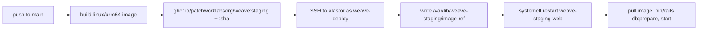

# Staging

Staging runs at **https://weave-staging.patchworklabs.org**. It is on the same host as
production (`alastor`), in separate containers with its own database and Redis.
Cloudflare Access sits in front of the hostname.

Staging runs the production image with `RAILS_ENV=production`. It behaves exactly like
production. Environment variables set the differences:

| Variable | Staging value | Effect |
| --- | --- | --- |
| `WEAVE_ENV` | `staging` | Reads `config/credentials/staging.yml.enc`, shows the "Staging" badge, prefixes mail subjects with `[staging] `, sends `X-Robots-Tag: noindex`. |
| `APP_HOST` | `weave-staging.patchworklabs.org` | Sets the OIDC issuer, mailer links, the canonical URL and the allowed `Host`. |
| `MAIL_ALLOWLIST` | for example `@patchworklabs.org` | Comma-separated list. An entry that starts with `@` is a domain, any other entry is an exact address. Mail to other recipients is dropped and logged. Set but empty means nobody gets mail. |
| `RAILS_MASTER_KEY` | contents of `config/credentials/staging.key` | Opens the staging credentials. |

When `WEAVE_ENV`, `APP_HOST` and `MAIL_ALLOWLIST` are unset, nothing changes. Code reads
them through `lib/weave.rb` (`Weave.staging?`, `Weave.host`, `Weave.url`,
`Weave.mail_allowlist`). Do not read them from `ENV` directly.

## Deploys

Every push to `main` deploys staging (`.github/workflows/deploy-staging.yml`). Production
deploys stay manual.



## Credentials

Staging has its own credentials file and key. Create or edit them with:

```bash
WEAVE_ENV=staging bin/rails credentials:edit
```

This opens `config/credentials/staging.yml.enc` and creates `config/credentials/staging.key`
if it does not exist. Commit the `.yml.enc` file. Never commit the key: put it in agenix for
the staging container's `RAILS_MASTER_KEY`.

Use new values for staging. Do not copy production secrets. The app reads these keys:

```yaml
secret_key_base:        # generated by credentials:edit
lockbox:
  master_key:           # Lockbox.generate_key
hashid:
  salt:
openid_connect:
  signing_key: |        # openssl genrsa 2048
resend:
  api_key:
okcomputer:
  username:
  password:
slack:                  # the staging Slack test workspace and app
  bot_token:
  user_token:
  browser_token:
  cookie:
  signing_secret:
  team_id:
  workspace_subdomain:
  coc_channel:
  coc_url:
  default_channels:
```
